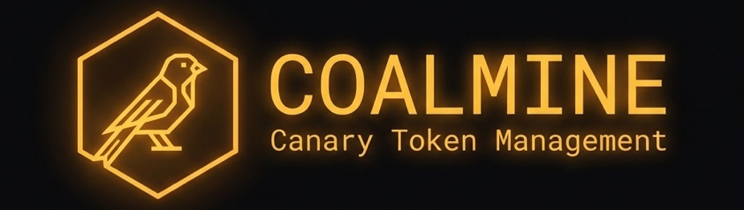

> **Cloud Canary Token Management** - Deploy, monitor, and rotate deceptive credentials across AWS and GCP to detect unauthorized access.

[](LICENSE)

> [!WARNING]
> **Alpha Version** - Coalmine is in early development. Basic functionality is the current priority, and the application should **not be considered fully security tested** for production use.

## Status

| Functional | Development (Unstable) | To Do |
|------------|------------------------|-------|
| AWS IAM User Canaries | GCP Service Account Canaries | Azure Support |
| AWS S3 Bucket Canaries | GCP Bucket Canaries | Web UI Dashboard |
| CloudTrail Monitoring | GCP Audit Log Monitoring | Syslog Alerts |
| Email Alerts | Automatic Rotation | SIEM Integration |
| Multi-Environment Support | | |
| PostgreSQL State Backend | | |
| REST API with API Key Auth | | |
| Webhook Alerts | | |

## Overview

Coalmine automatically deploys and monitors "canary tokens" - decoy credentials and resources that trigger alerts when accessed by attackers.

**Supported Providers:**
- **AWS**: IAM Users, S3 Buckets
- **GCP**: Service Accounts, Cloud Storage Buckets

## Features

- **Multi-Cloud Support** - AWS and GCP from a single interface
- **Automatic Rotation** - Credentials rotate on configurable intervals
- **Centralized Monitoring** - CloudTrail and GCP Audit Log integration
- **Flexible Alerting** - Email and Webhook notifications
- **Infrastructure as Code** - OpenTofu-managed resources
- **YAML Configuration** - Environment sync, API keys, and alert outputs
- **REST API** - Programmatic access with API key authentication
- **CLI** - Grouped subcommand structure (`coalmine <resource> <action>`)

## Quick Start

### Prerequisites

- Docker & Docker Compose
- AWS credentials (for AWS canaries)
- GCP credentials (for GCP canaries)

### 1. Clone & Configure

```bash
git clone https://github.com/yourorg/coalmine.git
cd coalmine
cp .env.example .env
# Edit .env with your database and cloud credentials
```

### 2. Start Services

```bash
docker compose up -d
```

### 3. Create a Cloud Environment

```bash
# Create an AWS environment
docker compose exec app coalmine env create dev-aws AWS \
  --credentials '{"AWS_ACCESS_KEY_ID": "...", "AWS_SECRET_ACCESS_KEY": "...", "AWS_REGION": "us-east-1"}'

# List environments to get the ENV_ID
docker compose exec app coalmine env list

# Or sync environments from YAML config
docker compose exec app coalmine env sync --dry-run
```

### 4. Create a Logging Resource

```bash
# Create CloudTrail logging destination
docker compose exec app coalmine logs create my-trail AWS_CLOUDTRAIL --env <ENV_ID>

# List logging resources to get the LOGGING_ID
docker compose exec app coalmine logs list
```

### 5. Deploy a Canary

```bash
# Create an AWS IAM User canary
docker compose exec app coalmine canary create my-canary AWS_IAM_USER \
  --env <ENV_ID> --logging-id <LOGGING_ID>

# Create a GCP Service Account canary
docker compose exec app coalmine canary create gcp-canary GCP_SERVICE_ACCOUNT \
  --env <GCP_ENV_ID> --logging-id <GCP_LOGGING_ID>

# List canaries
docker compose exec app coalmine canary list
```

### 6. Verify Detection

```bash
# Trigger a test alert
docker compose exec app coalmine canary trigger my-canary

# Wait for monitoring cycle (~1 min) then check alerts
docker compose exec app coalmine alerts list
```

## Architecture

```
┌─────────────┐   ┌─────────────┐
│     CLI     │   │  REST API   │
│  (coalmine) │   │  (FastAPI)  │
└──────┬──────┘   └──────┬──────┘
       │                 │
       └────────┬────────┘
                │
         ┌──────▼──────┐     ┌──────────────┐
         │    Redis    │────▶│    Celery    │
         │   (Broker)  │     │    Worker    │
         └─────────────┘     └──────┬───────┘
                                    │
              ┌─────────────────────┼─────────────────────┐
              │                     │                     │
       ┌──────▼──────┐       ┌──────▼──────┐       ┌──────▼──────┐
       │  OpenTofu   │       │  Monitors   │       │Notifications│
       │  Templates  │       │(CloudTrail) │       │(Email/Hook) │
       └──────┬──────┘       └──────┬──────┘       └─────────────┘
              │                     │
       ┌──────▼──────┐       ┌──────▼──────┐
       │  AWS / GCP  │       │    Alerts   │
       │ (Resources) │       │     (DB)    │
       └─────────────┘       └─────────────┘
                                    │
                             ┌──────▼──────┐
                             │  PostgreSQL │
                             │ (Inventory) │
                             └─────────────┘
                                    ▲
                             ┌──────┴──────┐
                             │ Celery Beat │
                             │ (Scheduler) │
                             └─────────────┘
```

## CLI Reference

Commands follow the pattern: `coalmine <resource> <action> [options]`

### Canary Commands

| Command | Description |
|---------|-------------|
| `canary create <name> <type>` | Create a new canary |
| `canary list` | List all canaries |
| `canary delete <name_or_id>` | Delete a canary |
| `canary creds <name>` | Get canary credentials |
| `canary trigger <name_or_id>` | Test canary detection |

### Environment Commands

| Command | Description |
|---------|-------------|
| `env create <name> <provider>` | Register cloud environment |
| `env list` | List environments |
| `env sync [--dry-run] [--force]` | Sync from YAML config |

### Logging Commands

| Command | Description |
|---------|-------------|
| `logs create <name> <type>` | Create logging resource |
| `logs list` | List logging resources |
| `logs scan --env <id>` | Scan existing CloudTrails |

### Alert Commands

| Command | Description |
|---------|-------------|
| `alerts list [--canary <name>]` | View security alerts |

### Help

```bash
docker compose exec app coalmine --help
docker compose exec app coalmine canary --help
```

## REST API

The API mirrors CLI functionality and requires API key authentication.

### Configuration (`config/api_keys.yaml`)

```yaml
api_keys:
  - key: "your-api-key-here"
    name: "admin"
    permissions: ["read", "write"]
    scopes: ["all"]
```

### Example Requests

```bash
# List canaries
curl -H "X-API-Key: your-api-key" http://localhost:8000/api/v1/canaries

# Create a canary
curl -X POST -H "X-API-Key: your-api-key" \
  -H "Content-Type: application/json" \
  -d '{"name": "api-canary", "resource_type": "AWS_IAM_USER", "environment_id": "...", "logging_id": "..."}' \
  http://localhost:8000/api/v1/canaries
```

## Configuration

### Alert Outputs (`config/alert_outputs.yaml`)

```yaml
outputs:
  email_admin:
    type: "email"
    enabled: true
    smtp_host: "smtp.example.com"
    smtp_port: 587
    to_addrs: ["security@example.com"]
  
  webhook_siem:
    type: "webhook"
    enabled: true
    url: "https://siem.example.com/webhook"
```

### Environments (`config/environments.yaml`)

```yaml
environments:
  - name: "prod-aws"
    provider: "AWS"
    credentials:
      AWS_ACCESS_KEY_ID: "${AWS_ACCESS_KEY_ID}"
      AWS_SECRET_ACCESS_KEY: "${AWS_SECRET_ACCESS_KEY}"
    config:
      region: "us-east-1"
```

Sync with: `docker compose exec app python -m src.cli env sync`

## Resource Types

| Type | Provider | Description |
|------|----------|-------------|
| `AWS_IAM_USER` | AWS | IAM user with access keys |
| `AWS_BUCKET` | AWS | S3 bucket with logging |
| `GCP_SERVICE_ACCOUNT` | GCP | Service account with keys |
| `GCP_BUCKET` | GCP | Cloud Storage bucket |

## Development

```bash
# Run all tests
docker compose run --rm app pytest -v

# Run unit tests only
docker compose run --rm app pytest tests/unit/ -v

# Run integration tests
docker compose run --rm app pytest tests/integration/ -v

# View worker logs
docker compose logs -f worker

# Rebuild after code changes
docker compose build && docker compose up -d
```

## Security Considerations

- **Never commit credentials** - Use `.env` files or secrets managers
- **Rotate admin credentials** - The cloud credentials used to manage canaries
- **Network isolation** - Run Coalmine in a secure network segment
- **Principle of least privilege** - Canary credentials should have minimal permissions
- **API key security** - Store API keys securely, rotate regularly

## License

[Apache License 2.0](LICENSE) - See LICENSE file for details.

## Contributing

See [CONTRIBUTING.md](CONTRIBUTING.md) for contribution guidelines.
