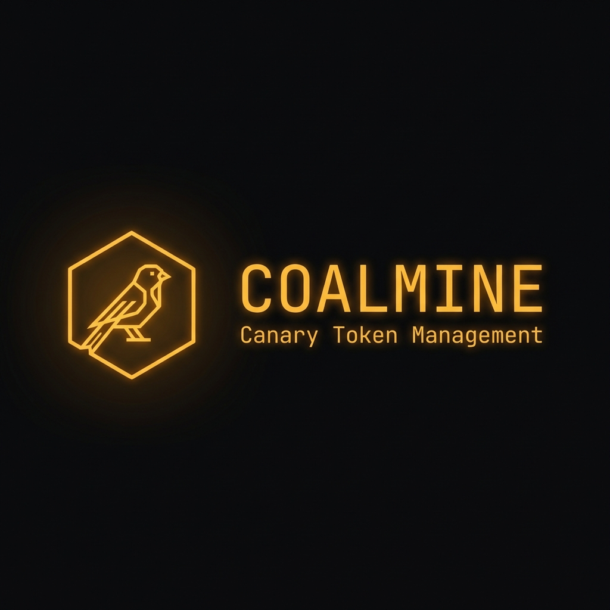

> **Cloud Canary Token Management** — Deploy, monitor, and rotate deceptive credentials across AWS and GCP to detect unauthorized access.

[](LICENSE)

> [!WARNING]
> **Alpha Version** — Coalmine is in early development. Basic functionality is the current priority, and the application should **not be considered fully security tested** for production use.

## Status

| Functional | Development (Unstable) | To Do |
|------------|------------------------|-------|
| AWS IAM User Canaries | GCP Service Account Canaries | Azure Support |
| AWS S3 Bucket Canaries | GCP Bucket Canaries | SIEM Integration |
| CloudTrail Monitoring | GCP Audit Log Monitoring | |
| PostgreSQL State Backend | Automatic Rotation | |
| REST API (API Key + Session Auth) | | |
| WebUI Dashboard | | |
| Email & Webhook Alerts | | |
| Credential & Account Management | | |
| RBAC (Casbin) | | |

## Overview

Coalmine automatically deploys and monitors "canary tokens" — decoy credentials and resources that trigger alerts when accessed by attackers.

**Supported Providers:**
- **AWS**: IAM Users, S3 Buckets
- **GCP**: Service Accounts, Cloud Storage Buckets

## Features

- **Multi-Cloud Support** — AWS and GCP from a single interface
- **Credential & Account Model** — Manage cloud credentials and accounts through CLI, API, or YAML sync
- **Automatic Rotation** — Credentials rotate on configurable intervals
- **Centralized Monitoring** — CloudTrail and GCP Audit Log integration
- **Flexible Alerting** — Email, Webhook, and Syslog notifications
- **Infrastructure as Code** — OpenTofu-managed resources
- **REST API** — Programmatic access with API key or session authentication
- **WebUI** — Browser-based dashboard at `/ui`
- **RBAC** — Role-based access control via Casbin
- **CLI** — Grouped subcommand structure (`coalmine <resource> <action>`)

## Quick Start

### Prerequisites

- Docker & Docker Compose
- AWS credentials (for AWS canaries)
- GCP credentials (for GCP canaries)

### 1. Clone & Configure

```bash
git clone https://github.com/yourorg/coalmine.git
cd coalmine
cp .env.example .env
# Edit .env with your database and cloud credentials
```

### 2. Start Services

```bash
docker compose up -d
```

This starts the API, Celery worker, Redis, and PostgreSQL. The WebUI is available at `http://localhost:8000/ui`.

### 3. Register Credentials & Accounts

```bash
# Add an AWS credential
docker compose exec app coalmine credentials add my-aws-cred AWS \
  --secrets '{"access_key_id": "...", "secret_access_key": "...", "region": "us-east-1"}'

# Add an account under that credential
docker compose exec app coalmine accounts add prod-east --credential my-aws-cred \
  --account-id 111111111111

# Or sync credentials and accounts from YAML config
docker compose exec app coalmine credentials sync --dry-run
```

### 4. Create a Logging Resource

```bash
# Create CloudTrail logging destination
docker compose exec app coalmine logs create my-trail AWS_CLOUDTRAIL \
  --account <ACCOUNT_ID>

# List logging resources
docker compose exec app coalmine logs list
```

### 5. Deploy a Canary

```bash
# Create an AWS IAM User canary
docker compose exec app coalmine canary create my-canary AWS_IAM_USER \
  --account <ACCOUNT_ID> --logging-id <LOGGING_ID>

# List canaries
docker compose exec app coalmine canary list
```

### 6. Verify Detection

```bash
# Trigger a test alert
docker compose exec app coalmine canary trigger my-canary

# Wait for monitoring cycle (~1 min) then check alerts
docker compose exec app coalmine alerts list
```

## Architecture

```
┌─────────────┐   ┌─────────────┐   ┌─────────────┐
│     CLI     │   │  REST API   │   │   WebUI     │
│  (coalmine) │   │  (FastAPI)  │   │  (React)    │
└──────┬──────┘   └──────┬──────┘   └──────┬──────┘
       │                 │                 │
       └────────┬────────┴────────┬────────┘
                │                 │
                │          ┌──────▼──────┐
                │          │Auth / RBAC  │
                │          │  (Casbin)   │
                │          └──────┬──────┘
                │                 │
         ┌──────▼─────────────────▼──────┐
         │         Celery Workers        │
         │  (Canary · Monitoring · Logs) │
         └──────────────┬────────────────┘
                        │
      ┌─────────────────┼─────────────────┐
      │                 │                 │
┌─────▼─────┐   ┌──────▼──────┐   ┌──────▼──────┐
│ OpenTofu  │   │  Monitors   │   │Notifications│
│ Templates │   │(CloudTrail/ │   │(Email/Hook/ │
│           │   │ Audit Logs) │   │   Syslog)   │
└─────┬─────┘   └──────┬──────┘   └─────────────┘
      │                │
┌─────▼─────┐   ┌──────▼──────┐
│ AWS / GCP │   │   Alerts    │
│(Resources)│   │    (DB)     │
└───────────┘   └─────────────┘

          ┌─────────────────┐
          │   PostgreSQL    │
          │   (Inventory)   │
          └────────┬────────┘
                   │
          ┌────────▼────────┐
          │   Celery Beat   │
          │   (Scheduler)   │
          └─────────────────┘
```

## CLI Reference

Commands follow the pattern: `coalmine <resource> <action> [options]`

### Canary Commands

| Command | Description |
|---------|-------------|
| `canary create <name> <type>` | Create a new canary |
| `canary list` | List all canaries |
| `canary delete <name_or_id>` | Delete a canary |
| `canary creds <name>` | Get canary credentials |
| `canary trigger <name_or_id>` | Test canary detection |

### Credential Commands

| Command | Description |
|---------|-------------|
| `credentials list` | List all credentials |
| `credentials add <name> <provider>` | Add a credential |
| `credentials update <name_or_id>` | Update a credential |
| `credentials remove <name_or_id>` | Remove a credential |
| `credentials validate <name_or_id>` | Validate credential health |
| `credentials sync [--dry-run]` | Sync from YAML config |

### Account Commands

| Command | Description |
|---------|-------------|
| `accounts list [--credential <name>]` | List all accounts |
| `accounts add <name>` | Add an account |
| `accounts update <name_or_id>` | Update an account |
| `accounts enable <name_or_id>` | Enable an account |
| `accounts disable <name_or_id>` | Disable an account |
| `accounts remove <name_or_id>` | Remove an account |
| `accounts validate <name_or_id>` | Validate account health |

### Logging Commands

| Command | Description |
|---------|-------------|
| `logs create <name> <type>` | Create logging resource |
| `logs list` | List logging resources |
| `logs scan --account <id>` | Scan existing CloudTrails |

### Alert Commands

| Command | Description |
|---------|-------------|
| `alerts list [--canary <name>]` | View security alerts |

### Auth Commands

| Command | Description |
|---------|-------------|
| `auth key list` | List API keys |
| `auth key add <name>` | Add an API key |
| `auth session list` | List active sessions |

### User Commands

| Command | Description |
|---------|-------------|
| `user list` | List all users |
| `user roles` | List available roles |

### Task Commands

| Command | Description |
|---------|-------------|
| `task list` | View recent async tasks |
| `task status <task_id>` | Check task result |

### Help

```bash
docker compose exec app coalmine --help
docker compose exec app coalmine canary --help
```

## REST API

The API runs at `http://localhost:8000` and requires authentication via API key header or session cookie.

### Configuration (`config/api_keys.yaml`)

```yaml
api_keys:
  - key: "your-api-key-here"
    name: "admin"
    permissions: ["read", "write"]
    scopes: ["all"]
```

### Example Requests

```bash
# List canaries
curl -H "X-API-Key: your-api-key" http://localhost:8000/api/v1/canaries

# Create a canary
curl -X POST -H "X-API-Key: your-api-key" \
  -H "Content-Type: application/json" \
  -d '{"name": "api-canary", "resource_type": "AWS_IAM_USER", "account_id": "...", "logging_id": "..."}' \
  http://localhost:8000/api/v1/canaries
```

### API Documentation

Interactive API docs are available at `http://localhost:8000/docs` (Swagger UI).

## Configuration

All configuration lives in the `config/` directory. See [config/README.md](config/README.md) for details.

### Credentials (`config/credentials.yaml`)

```yaml
credentials:
  my-aws-cred:
    provider: AWS
    auth_type: STATIC
    secrets:
      access_key_id: ${AWS_ACCESS_KEY_ID}
      secret_access_key: ${AWS_SECRET_ACCESS_KEY}
      region: ${AWS_DEFAULT_REGION:-us-east-1}
    accounts:
      - name: prod-east
        account_id: "111111111111"
```

Sync with: `docker compose exec app coalmine credentials sync`

### Alert Outputs (`config/alert_outputs.yaml`)

```yaml
outputs:
  email_admin:
    type: "email"
    enabled: true
    smtp_host: "smtp.example.com"
    smtp_port: 587
    to_addrs: ["security@example.com"]
  
  webhook_siem:
    type: "webhook"
    enabled: true
    url: "https://siem.example.com/webhook"
```

## Resource Types

| Type | Provider | Description |
|------|----------|-------------|
| `AWS_IAM_USER` | AWS | IAM user with access keys |
| `AWS_BUCKET` | AWS | S3 bucket with logging |
| `GCP_SERVICE_ACCOUNT` | GCP | Service account with keys |
| `GCP_BUCKET` | GCP | Cloud Storage bucket |

## Development

```bash
# Run all tests
docker compose run --rm app pytest -v

# Run unit tests only
docker compose run --rm app pytest tests/unit/ -v

# Run integration tests
docker compose run --rm app pytest tests/integration/ -v

# View worker logs
docker compose logs -f worker

# Rebuild after code changes
docker compose build && docker compose up -d
```

## Security Considerations

- **Never commit credentials** — Use `.env` files or secrets managers
- **Rotate admin credentials** — The cloud credentials used to manage canaries
- **Network isolation** — Run Coalmine in a secure network segment
- **Principle of least privilege** — Canary credentials should have minimal permissions
- **API key security** — Store API keys securely, rotate regularly

## License

[Apache License 2.0](LICENSE) — See LICENSE file for details.

## Contributing

See [CONTRIBUTING.md](CONTRIBUTING.md) for contribution guidelines.
